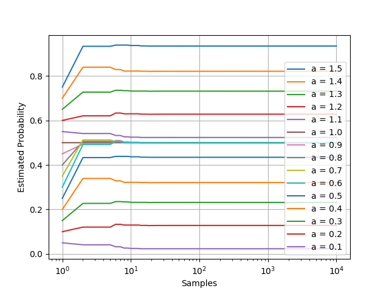
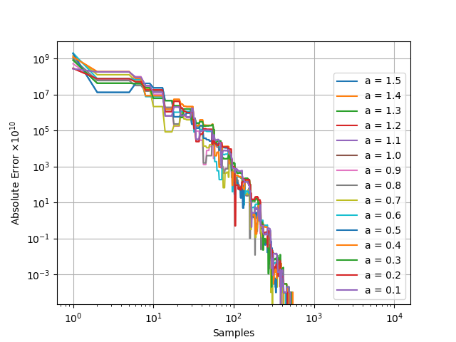

今天与大家分享一个很高效的精确求解无穷个随机变量之和的CDF（[累积分布函数](https://en.wikipedia.org/wiki/Cumulative_distribution_function)）的方法。

题意：设，其中为互相独立的正随机变量。已知有上界。给定一个正数，希望求出。

尝试：由于题目是无穷个随机变量的和，无法一个个枚举所有变量的情况，而且由[大数定理](https://en.wikipedia.org/wiki/Law_of_large_numbers)，$Y$的分布类似于高斯分布，[重尾效应](https://en.wikipedia.org/wiki/Heavy-tailed_distribution)严重（即有限的部分和无法精确拟合真正的$Y$的分布），故直接暴力枚举（有限个）$X_i$并不能精确求解概率。

分析：定义函数
$$
f(x) =
  \begin{cases}
    1       & \quad \text{if } 0 \leq x < a\\
    0  & \quad \text{if } a \leq x < U \\
  \end{cases}
$$
可以发现$Pr[Y<a]=E[f(Y)]$。观察到$f(x)$定义域是$[0,U)$，可将$f(x)$周期延拓至整个实数轴，并将$f(x)$展开成**傅里叶级数**，有傅里叶系数$a_n=\frac{2}{U}\int_{0}^{U}cos(2\pi x \frac{n}{U})=\frac{sin(2 \pi \frac{n}{U} a)}{\pi n}(n \geq 1)$，$a_0=\frac{2a}{U}$，$b_n=\frac{2}{U}\int_{0}^{U}sin(2\pi x \frac{n}{U})=\frac{1-cos(2 \pi \frac{n}{U} a)}{\pi n}(n \geq 1)$。于是可以得到$$f(x)=\frac{a_0}{2}+\sum_{n \geq 1}[a_n cos(\frac{2 \pi n x}{U})+b_n sin(\frac{2 \pi n x}{U})]$$

$=\frac{a}{U}+\sum_{n \geq 1}[\frac{\sin{(2\pi \frac{n}{U}a)}}{\pi n}\cdot \cos{(2\pi \frac{n}{U}x)} + \frac{1 - \cos{(2\pi \frac{n}{U}a)}}{\pi n} \cdot \sin{(2\pi \frac{n}{U}x)}]$。

令$A_n=\frac{2\pi n}{U}$，上式化简为$f(x)=\frac{a}{U}+\frac{2}{U}\sum_{n \geq 1}[\frac{\sin(a A_n)}{A_n} \cos{(A_n x)} + \frac{1 - \cos(a A_n)}{A_n} \sin{(A_n x)}]$。由欧拉公式$e^{ix}=\cos{x}+i\sin{x}$，可以发现$\cos{x}=Re(e^{ix})=\frac{e^{ix}+e^{-ix}}{2}$，$\sin{x}=Im(e^{ix})=\frac{e^{ix}-e^{-ix}}{2i}$。继续代入，得到$f(x)=\frac{a}{U}+\frac{2}{U}\sum_{n \geq 1}[\frac{\sin(a A_n)}{A_n} \frac{e^{iA_n x } - e^{-iA_n x}}{2} + \frac{1 - \cos(a A_n)}{A_n} \frac{e^{iA_n x } - e^{-iA_n x}}{2i}]$。

代入一下$x=Y$，由于期望的线性累加性，可以发现我们需要求$e^{iA_n Y}$和$e^{-iA_n Y}$的期望。

下面介绍一下概率论中的特征函数。对随机变量$X$，它的特征函数定义为$\varphi_{X}(t)=E[e^{itX}]$，其中指数上的$i$是虚数单位。它与概率分布函数一样，也完全定义了随机变量的所有性质。可以看到$e^{iA_n Y}=\varphi_{Y}(A_n)$，$e^{-iA_n Y}=\varphi_{Y}(-A_n)$。代入一下，得到$Pr[Y<a]=E[f(Y)]=\frac{a}{U}+\frac{2}{U}\sum_{n \geq 1}[\frac{\sin(a A_n)}{A_n} \frac{\varphi_{Y}(A_n) - \varphi_{Y}(-A_n)}{2} + \frac{1 - \cos(a A_n)}{A_n} \frac{\varphi_{Y}(A_n) - \varphi_{Y}(-A_n)}{2i}]$（公式1）。

好了，接下来我们利用$Y$的性质去求它的特征函数。$\varphi_{Y}(t)=E[e^{itY}]=E[e^{it(\sum_{j \geq 1}X_j)}]=E[\prod_{j \geq 1}e^{itX_j}]=\prod_{j \geq 1}E[e^{itX_j}]=\prod_{j \geq 1}\varphi_{X_j}(t)$（倒数第二步用到了$X_j$之间互相独立的性质）。对于不同的$X_j$，我们可以单独计算其特征函数，他们的乘积即为$Y$的特征函数。

（建议自己手推一下加深理解；如果觉得步骤太麻烦，记住最后的结论就可以用啦~）

上面写了那么多理论公式，我们来看看实际怎么应用吧。

例题：

令
$$
X_j =
  \begin{cases}
    \frac{1}{j^2}       & \quad \text{以}\frac{1}{2}\text{概率 } \\
    0  & \quad \text{以}\frac{1}{2}\text{概率 } \\
  \end{cases}
$$
设$Y=\sum_{j=1}^{\infty}X_j$，其中$X_j$互相独立。给定一个正数$a$，希望求出$Pr[Y < a]$。

解：

可以发现$Y$的上界是$\sum_{i \geq 1}\frac{1}{i^2}=\zeta(2)=\frac{\pi^2}{6}$。$X_j$的特征函数为$\varphi_{X_j}(t)=E[e^{itX_j}]=\frac{e^{\frac{it}{j^2}}+1}{2}$。所以$Y$的特征函数为$\varphi_{Y}(t)=\prod_{j \geq 1}\varphi_{X_j}(t)=\prod_{j \geq 1}\frac{e^{\frac{it}{j^2}}+1}{2}$

$=\prod_{j \geq 1}e^{\frac{it}{2j^2}}\frac{e^{\frac{it}{2j^2}}+e^{-\frac{it}{2j^2}}}{2}=e^{\frac{it}{2}\sum_{j \geq 1}\frac{1}{j^2}}\prod_{j \geq 1}\cos{(\frac{t}{2j^2})}=e^{it\frac{\pi^2}{12}}\prod_{j \geq 1}\cos{(\frac{t}{2j^2})}$。代入上面公式1中，对每个固定的$n$，我们估算$\varphi_{Y}(t) \approx \prod_{1 \leq j \leq 1000}\varphi_{X_j}(t)=e^{it\frac{\pi^2}{12}}\prod_{1 \leq j \leq 1000}\cos{(\frac{t}{2j^2})}$（即取前一千项乘积作近似）；我们算前$10000$个$n$值，即可达$10$位收敛精度。

附上代码（这里我用了更宽松的上界$2$）：

```
#include <cstdio>
#include <cmath>
const double a=0.5,U=2;
int main()
{
    double ans=0;
    for (int n=1;n<=10000;++n)
    {
        const double A=2*M_PI*n/U;
        double temp=1;
        for (int i=1;i<=1000;++i)
            temp*=cos(A/2/i/i);
        ans+=(sin(A*a)*(cos(A*M_PI*M_PI/12))+(1-cos(A*a))*(sin(A*M_PI*M_PI/12)))*temp/A;
    }
    printf("%.12f\n",(ans*2+a)/U);
    return 0;
}

```

更进一步，不同$n$的计算直接没有依赖，可进一步结合并行技巧进行加速。

收敛性分析：这里取了若干$a$进行分析，横轴表示$n$的样本数量，纵轴表示计算的概率值。（注意到$a$在$0.6$到$1.0$之间的概率都一样，这是因为若不取第一项1，后面所有项的和是$\frac{\pi^2}{6}-1 \approx 0.64493407>0.6$，所以无论怎么取都不会超过$0.6$，即对$\forall 0.6 \leq a \leq 1, Pr[Y<a]=Pr[Y<0.6]$。）



把绝对误差放大$10^{10}$倍，再详细观察算法的收敛性：



可以看到在$500$个样本之后所有情况的收敛效果已经非常好了（误差均达到了$10^{-13}$）级别以下。

关于此方法的收敛性分析：傅里叶系数以$O(\frac{1}{n})$速度收敛，特征函数最坏情况下以常数速度收敛，但一般常用函数情况下以$O(e^{-n})$速度指数级收敛，一般使用几万个样本即可收敛至$10$位小数，非常高效。

关于上界$U$的分析：$U$不一定使用$Y$的上确界。实测下来发现即使$U$比上确界大几十倍，收敛效果依然很好。此方法在难以估算$Y$上确界的情况下也可使用，扩展性高。

关于随机变量$X_i$的正负：以上方法可扩展至任意有界的随机变量，过程从略，有兴趣的同学可以自行练手。

关于是否是无穷个随机变量的求和：以上方法可直接应用于有限个随机变量的求和，简单粗暴。

关于随机变量$X_i$是连续变量or离散变量：以上方法也可直接应用，简单粗暴*2。

